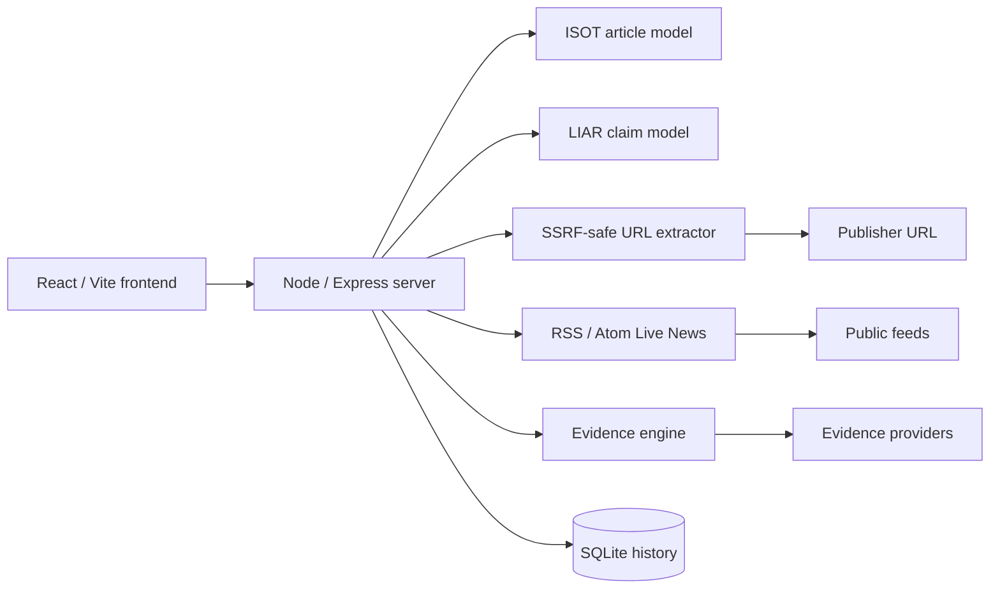

# TruthLens AI

TruthLens AI is a TypeScript/Node.js system for news-analysis assistance. It combines an ISOT-trained article classifier, a separate LIAR claim model, URL article extraction, live RSS/Atom news, retrieval-based evidence verification, and SQLite-backed history.

[](https://truthlens-ai-dvpf.onrender.com)
[](package.json)
[](tsconfig.json)
[](https://github.com/Pappu246/truthlens-ai-fake-news-detection-system/actions/workflows/ci.yml)

> TruthLens is a decision-support and verification-support system. A model output, probability, evidence status, or citation is not proof that a real-world article or claim is true or false.

## Verified release snapshot

The current application source of truth is `main` at commit [`7e570a5`](https://github.com/Pappu246/truthlens-ai-fake-news-detection-system/commit/7e570a56288da85f2a90acb8d0c1dd051bd142ab). The post-merge production smoke workflow completed successfully with **55/55 checks passed** against the Render deployment on 2026-09-26 UTC: [workflow run](https://github.com/Pappu246/truthlens-ai-fake-news-detection-system/actions/runs/36241411149).

Article and claim measurements below are separate benchmarks. They must not be added, averaged, or presented as one overall accuracy.

## What is in production?

| Component | Data and task | Runtime endpoint | Verified benchmark/result |
|---|---|---|---|
| Article model | ISOT full-article `REAL` / `FAKE` classification | `/api/analyze` | Linear SVM, held-out accuracy **0.9959**, test `n=7,732` |
| Claim model | LIAR binary `TRUE` / `FALSE` claim classification | `/api/claim/predict` | `text_only` accuracy **0.6271820449**, macro-F1 **0.6152909487**, test `n=802` |
| Evidence engine | Live retrieval and support/contradiction analysis | `/api/evidence/verify` | Per-request signal; no stored accuracy number |

The API exposes separate `article_model`, `claim_model`, and `benchmarks` blocks from `/api/models/metrics`. The models solve different tasks on different corpora.

> **Research stack note:** `server/v2/**` and `POST /api/v2/evidence/verify` are an additive, experimental TruthLens V2 evidence-grounded verification research stack — a first vertical slice, not a production component and not part of the verified release snapshot above. See [`docs/V2_ARCHITECTURE.md`](docs/V2_ARCHITECTURE.md), [`docs/V2_BENCHMARK_PROTOCOL.md`](docs/V2_BENCHMARK_PROTOCOL.md), and [`docs/V2_KNOWN_LIMITATIONS.md`](docs/V2_KNOWN_LIMITATIONS.md).

## Article model

The production article artifact is **Linear SVM (Calibrated), `v3.0.0-isot`**, using an 8,000-feature TF-IDF representation with 1–2 grams and sublinear term frequency. Probabilities use Platt sigmoid calibration.

It was evaluated on the genuine held-out ISOT test split:

| Metric | Value |
|---|---:|
| Dataset after cleaning | 38,656 samples |
| Held-out test samples | 7,732 |
| Accuracy | 0.9959 |
| Precision, `FAKE (1)` | 0.9943 |
| Recall, `FAKE (1)` | 0.9966 |
| F1, `FAKE (1)` | 0.9954 |
| 5-fold CV F1 mean ± std | 0.9955 ± 0.0008 |

Held-out confusion matrix, laid out as `[[TN, FP], [FN, TP]]`, is `[[4219, 20], [12, 3481]]`.

The model's default decision thresholds are `P(FAKE) >= 0.65` for `LIKELY FAKE` and `P(FAKE) <= 0.35` for `LIKELY REAL`. Inputs that fail context guards or fall in the uncertainty zone return `NEEDS MORE CONTEXT` rather than a forced binary result. Guarded responses withhold fake/real probabilities.

These figures describe performance on the ISOT benchmark distribution. They are not guaranteed current-news or real-world fact-checking accuracy. For example, the separately reported out-of-domain evaluation on eligible binary LIAR claims is much lower: accuracy **0.4329**, macro-F1 **0.3265**, `n=790`. That is domain-shift evidence, not an article-model replacement benchmark.

## Claim model

The claim model is a separate artifact, **`1.1.0-liar-claim`**, trained on the LIAR dataset for binary claim veracity. `true` and `mostly-true` map to `TRUE`; `false` and `pants-fire` map to `FALSE`. The ordinal middle labels `half-true` and `barely-true` are excluded instead of being forced into either class.

Split sizes are 6,471 train, 799 validation, and 802 test. The decision threshold is fixed at 0.50 and the test split is used only after selection and calibration are frozen.

| Served variant | Test accuracy | Test macro-F1 | ROC-AUC | Brier | Test n |
|---|---:|---:|---:|---:|---:|
| `text_only` | 0.6271820449 | 0.6152909487 | 0.6797482838 | 0.2233191107 | 802 |
| `text_meta` | 0.6583541147 | 0.6469730171 | 0.7184401220 | 0.2087078341 | 802 |

- Without complete speaker metadata, the API serves `text_only` and explicitly reports `metadata_available: false`.
- With complete speaker, party, and credit-history metadata, the API may serve `text_meta`.
- Python/Node parity is verified on all 802 test rows in both variants: maximum probability drift `2.220e-16`, zero threshold label flips.
- The LIAR result is a modest weak signal, not a guaranteed fact-checking verdict. It is not combined with the ISOT article score.

### Metadata leakage finding

LIAR's five speaker credit-history columns include the accompanying statement's own verdict contribution. Raw use produces a misleading diagnostic result: test accuracy `0.8004987531` and macro-F1 `0.7968141369`. The served metadata variant subtracts the current statement's contribution before feature construction; the measured test-accuracy gap is `0.1421`. The raw-credit variant is diagnostic-only and is never served.

For the full protocol and leakage audit, see [docs/CLAIM_MODEL.md](docs/CLAIM_MODEL.md) and [docs/claim_model_report.json](docs/claim_model_report.json).

## Evidence engine

The evidence engine is an independent retrieval pipeline, not a third model accuracy number:

```text
claim -> query extraction -> provider retrieval -> relevance analysis
      -> support/contradiction assessment -> aggregated verification signal
```

`POST /api/evidence/verify` can return:

- `SUPPORTED`
- `CONTRADICTED`
- `MIXED`
- `INSUFFICIENT_EVIDENCE`
- `NEEDS_MORE_CONTEXT`
- `SEARCH_UNAVAILABLE`

Retrieval failure and no hits are visible states. They are never converted into a fabricated citation or a forced true/false verdict. Every returned citation is tied to a URL actually supplied by a provider and includes provenance such as domain and retrieval timestamp. Retrieved text is marked `UNTRUSTED_DATA`; instruction-shaped content is neutralised before it enters an evidence record.

The deterministic evidence suite passes **53/53** assertions, including prompt-injection defence, source provenance, no-fabrication behavior, support/contradiction/mixed aggregation, and retrieval-unavailable handling. See [docs/EVIDENCE_ENGINE.md](docs/EVIDENCE_ENGINE.md).

## URL extraction

The URL pipeline validates a URL, performs SSRF-safe fetching, validates redirects hop by hop, extracts article metadata/body text, and then analyzes the freshly extracted body. It does not reuse stale text from a previous request.

Security and reliability controls include:

- permitted protocol and URL validation;
- loopback, private, link-local, reserved-address, and DNS-rebinding checks;
- manual redirect validation;
- request timeout and response-size limits;
- content-type checks and rate limiting;
- precise handling of publisher `403`, `404`, `429`, timeout, and gateway outcomes;
- removal of scripts, hidden content, HTML comments, and common boilerplate before extraction.

Relevant routes are `POST /api/article/extract` and `POST /api/analyze-url`. A successful extraction carries extraction status, warnings, word count, provenance, and a content-source label. A failed extraction does not claim that a full article was extracted.

## Live News and `content_source`

`GET /api/news/latest` reads configured RSS/Atom feeds, deduplicates items, and labels each item at the server before returning it. The server label is the source of truth for every API consumer, not only the browser.

| Label | Meaning |
|---|---|
| `RSS_SUMMARY_ONLY` | Feed supplied a substantive description/summary of at least 40 words; this is not a full article body. |
| `HEADLINE_ONLY` | Description is empty or below 40 words; the item is not presented as an article body. |
| `FULL_ARTICLE_EXTRACTED` | Reserved for the article extraction path after actual article content has been fetched and extracted; the RSS/Atom provider never emits it. |
| `EXTRACTION_BLOCKED` | Publisher blocked live article extraction; the UI may fall back to a clearly labelled RSS summary or withhold analysis. |

Each feed item also exposes `is_headline_only` and the feed-body `word_count`. Both RSS `<item>` and Atom `<entry>` paths use the same 40-word boundary. The frontend prefers the server-provided label and retains the same rule only as a compatibility fallback for older payloads.

Headline-only content is guarded as `NEEDS_MORE_CONTEXT`; the application does not force a prediction from a headline.

## API surface

| Route | Purpose |
|---|---|
| `GET /api/health` | Service, article-model, claim-model, and evidence-engine readiness |
| `GET /api/models/metrics` | Separate article, claim, benchmark, and separation metadata |
| `GET /api/model/diagnostics` | Loaded artifact and runtime diagnostics |
| `POST /api/analyze` | Analyze supplied article text |
| `POST /api/analyze-url` | Securely extract and analyze a URL |
| `POST /api/article/extract` | Secure article extraction without classification |
| `GET /api/news/latest` | Live RSS/Atom news with server-side content labels |
| `GET /api/claim/metrics` | Claim-model metrics and protocol |
| `POST /api/claim/predict` | LIAR claim prediction with explicit variant metadata |
| `POST /api/evidence/verify` | Retrieval-backed evidence verification |

## Architecture

TruthLens is deployed as one Node/Express service. The browser calls same-origin `/api/*` routes; the Python code is an offline training/evaluation pipeline and is not the production API.



Important production code:

- `server/mlEngine.ts` — article artifact loading, guards, calibrated probabilities, and verdict contract.
- `server/claimModel.ts` — dedicated LIAR artifact and metadata-aware scoring.
- `server/extraction/articleExtractor.ts` — article-body and metadata extraction.
- `server/security/urlValidator.ts` — URL validation, SSRF protection, safe fetching, and redirect checks.
- `server/news/rssProvider.ts` — RSS/Atom parsing and server-side content-source labeling.
- `server/verification/` — claim extraction, retrieval, evidence sanitisation, relevance, and stance.
- `server/sqliteHistory.ts` — analysis history.

## Getting started

### Requirements

- Node.js 20 or newer.
- Python 3 only for the offline training/research pipeline.
- `GEMINI_API_KEY` is optional and must be supplied through the environment when a configured verification integration needs it.

### Install and run

```bash
npm ci
npm run dev
```

The local service uses port 3000 unless `PORT` is set. For a production-style local build:

```bash
npm run build
npm start
```

Do not commit API keys or other credentials.

### Environment variables

| Variable | Required | Purpose |
|---|---|---|
| `PORT` | No | HTTP port; defaults to 3000 locally. |
| `NODE_ENV` | Deployment setting | Render sets this to `production`. |
| `GEMINI_API_KEY` | Optional | Optional configured verification integration. |
| `NEWS_RSS_FEEDS` | Optional | JSON array or comma-separated feed URLs for controlled feed configuration. |

## Testing and verification

```bash
npm run lint
npm run build
npm run test:all
```

Verified on current `main`:

| Command | Result |
|---|---|
| `npm run test:contracts` | **90 passed, 0 failed** |
| `npm run test:vercel-sim` | Pass |
| `npm run test:verdicts` | **26 assertions passed** |
| `npm run test:claim` | **79 passed, 0 failed** |
| `npm run test:claim-parity` | **802/802** rows in each of two variants; zero flips |
| `npm run test:evidence` | **53 passed, 0 failed** |
| `npm run test:artifacts` | **12 passed, 0 failed** |
| `npm run test:ssrf` | **8 passed, 0 failed** |
| `npm run test:production -- <url>` | Production smoke script; post-merge GitHub Actions result is **55/55** |

The sandbox could not directly reach the Render deployment, so the POST/live production checks were executed by [GitHub Actions](https://github.com/Pappu246/truthlens-ai-fake-news-detection-system/actions/runs/36241411149). Local tests use deterministic seams for network-dependent evidence and extraction cases.

## Deployment

`render.yaml` defines the single Node web service:

- build: `npm install && npm run build`
- start: `npm start`
- `NODE_ENV=production`
- optional secret `GEMINI_API_KEY`

The deployed demo is [truthlens-ai-dvpf.onrender.com](https://truthlens-ai-dvpf.onrender.com).

## Limitations

1. The article benchmark is measured on ISOT and may not generalize to current news, satire, Hindi/Hinglish text, or other domains.
2. The LIAR claim model is a weak-signal political-claim classifier. Its result is not guaranteed fact-checking accuracy, and the LIAR benchmark must not be combined with the ISOT score.
3. `text_meta` is metadata-conditioned. The raw credit-history diagnostic is not served because it contains label leakage.
4. Evidence relation is inferred from retrieved headlines/snippets, not full-article entailment. `SUPPORTED` is corroboration, not proof.
5. RSS summaries are not full article bodies. Headline-only items are withheld as `NEEDS_MORE_CONTEXT`.
6. Live retrieval depends on outbound network access; unavailable retrieval is reported explicitly.
7. `npm audit` currently reports two moderate advisories in the `qs` dependency path used by Express. These require separate dependency maintenance.

## Repository layout

```text
src/                         React/Vite frontend
server.ts                   Node/Express entry point
server/                     Production services and API implementation
backend/                    Offline Python ML/research pipeline
data/                       Datasets and runtime model artifacts
docs/                       Architecture, benchmark, evidence, and release reports
scripts/                    Training, parity, regression, and smoke checks
render.yaml                 Render deployment definition
```

See [docs/FINAL_REPORT.md](docs/FINAL_REPORT.md) for the complete final release audit, including PR #23 promotion, exact benchmark values, security results, deployment verification, and known limitations.
