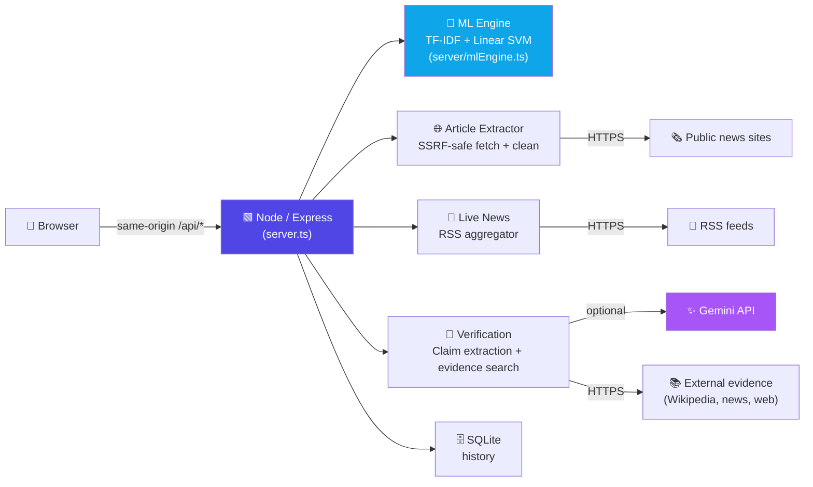

<div align="center">

# 🔍 TruthLens AI

### AI-Powered Fake News Detection & Article Verification System

*A calibrated Linear SVM verification engine for news content, safe web URL extraction, and live RSS wire feeds.*

[](https://truthlens-ai-dvpf.onrender.com)
[](package.json)
[](tsconfig.json)
[](package.json)
[](#)

**[🚀 Try it live](https://truthlens-ai-dvpf.onrender.com)** · [Features](#-features) · [Architecture](#-architecture) · [Verdict Contract](#-verdict-contract) · [Deploying](#-deploying-to-render) · [Tests](#-running-the-tests)

</div>

---

## 📖 About

TruthLens AI estimates whether a piece of news text is **likely real**, **likely fake**, or whether it simply **needs more context** to judge fairly — and says so honestly. It never forces a confident verdict out of a headline, a one-line rumor, or a claim with no source. Instead of pretending to be an oracle of truth, it combines a calibrated ML classifier with real evidence retrieval, and shows its reasoning at every step.

Built as a B.Tech CSE-AIML **Trans-Disciplinary Project (TDP)**, spanning machine learning, NLP, full-stack engineering, and responsible-AI design.

## ✨ Features

| | |
|---|---|
| 🧠 **Calibrated ML classification** | TF-IDF + Linear SVM with Platt sigmoid calibration — real probabilities, not guesses |
| 🛡️ **Honest uncertainty** | Short, headline-only, or source-less input returns `NEEDS MORE CONTEXT` — never a fabricated 99% |
| 🌐 **Safe URL extraction** | SSRF-protected article fetching — validates, sandboxes, and cleanly extracts article bodies from any link |
| 🔎 **Claim-level verification** | Extracts factual claims and cross-checks them against live web evidence (Wikipedia, news sources) via Gemini |
| 📡 **Live news wire** | Real-time RSS dispatches from BBC, NPR, PBS and more — click any headline to analyze instantly |
| 📊 **Model transparency** | Full model specs, cross-validation metrics, and dataset validation reports — no hidden numbers |
| 🕘 **Analysis history** | Every analysis is persisted locally (SQLite) and browsable |
| ⚡ **Single-service deploy** | One Node/Express service serves the frontend *and* every API route — no fragile multi-service split |

## 🖼️ Screenshots

<!--
  Drop your own screenshots into a `docs/screenshots/` folder and swap the
  paths below — GitHub renders these inline once the images exist in the repo.
  Example:
    
    
    
-->
> 📸 *Add screenshots of the Analyze, Live News, and Claim Verification views here — see the comment in this section for the exact markdown.*

## 🏗️ Architecture

TruthLens AI runs as **one Node/Express service**. There is no separate serverless proxy layer and no separate Python API in production — the frontend only ever calls same-origin, relative `/api/*` paths.



`backend/` (Python/FastAPI + scikit-learn) is kept in the repo as an **offline research/training reference only** — useful for the TDP report's data-science sections (`scripts/train_isot.py`, `scripts/evaluate_liar.py`, `backend/ml/*.py`) — but it is not deployed and is not called by the running app. The Node engine is the single source of truth for verdicts.

## 🧪 Verdict Contract

Every analysis returns exactly one of three verdicts (`prediction`, with a `verdict` alias in the API response):

| Verdict | Meaning |
| --- | --- |
| ✅ `LIKELY REAL` | Model probability P(FAKE) at or below the real threshold |
| ⚠️ `LIKELY FAKE` | Model probability P(FAKE) at or above the fake threshold |
| ❓ `NEEDS MORE CONTEXT` | Input was guarded (too short / headline-only / vague / no source context) or the probability fell inside the configured uncertainty zone |

**Guarantees:**

- Short, headline-only, vague, incomplete, or source-less content is **never classified**. The response sets `fake_probability`, `real_probability`, `confidence` and `confidence_score` to `null` (rendered as `N/A`) so no fake percentage can be displayed.
- Empty input is a validation error (HTTP 400/422), never a crash.
- Uncertain predictions inside the uncertainty zone return `NEEDS MORE CONTEXT` with a `reason` explaining the zone; confidence is `null`.
- Models trained on small demo datasets (N ≤ 50) use a **widened uncertainty zone** (0.40 – 0.75 instead of 0.35 – 0.65) and are flagged with `model_reliability: "DEMO_DATASET"`; extreme (≥ 90%) probabilities carry a `probability_caveat` explaining they are not statistically supported.
- Probabilities are mapped from `predict_proba` columns via `model.classes_` (FAKE = class 1, REAL = class 0) — never by positional assumption — and loaded model artifacts are integrity-checked at startup; broken or out-of-sync artifacts trigger an automatic retrain instead of saturated ~99% scores.
- Failed article extraction (blocked/forbidden/unreachable target site) is surfaced with the correct HTTP status (`502`/`504`/`404`) and a clear message — never silently treated as success, never a raw crash.

## 🚀 Getting Started

### Prerequisites

- Node.js ≥ 20
- (Optional) Python 3, only if you want to run the offline research pipeline in `backend/`
- (Optional) A [Gemini API key](https://ai.google.dev/) for claim extraction / evidence-search features

### Install & run locally

```bash
npm install
npm run build
npm start          # production mode → http://localhost:3000
# or, for hot-reload during development:
npm run dev
```

### Environment variables

| Variable | Required | Purpose |
|---|---|---|
| `NODE_ENV=production` | ✅ for production | Serves the built app instead of the Vite dev server |
| `PORT` | Auto-set by host | Render/Railway inject this — don't set it yourself |
| `GEMINI_API_KEY` | Optional | Powers `/api/claims/extract`, `/api/evidence/search`, `/api/verify-claims`, `/api/verify-article` |

## ☁️ Deploying to Render

1. Push this repo to GitHub.
2. In Render: **New +** → **Web Service** → connect the repo. `render.yaml` pre-fills everything, or set manually:
   - **Runtime:** Node
   - **Build Command:** `npm install && npm run build`
   - **Start Command:** `npm start`
   - **Env vars:** `NODE_ENV=production` (required), `GEMINI_API_KEY` (optional)
3. Deploy. Render gives you one stable URL — that's the only production URL; there's no separate frontend/backend deployment to keep in sync.

## ✅ Running the Tests

```bash
# Frontend type-check / build
npm run lint
npm run build

# Node (Express) backend suites
npx tsx scripts/regressionVerdictTests.ts   # verdict contract + label-swap + artifact integrity
npx tsx scripts/test_pipeline.ts            # full ML pipeline validation

# Python (offline research pipeline)
.venv/bin/python backend/tests/test_verdicts.py
```

## 📁 Project Structure

```
src/       → frontend application and UI components
server/    → server-side services, ML engine, verification, security, and history
backend/   → Python ML pipeline, models, and verification utilities (offline reference)
data/      → datasets and validation data
scripts/   → training, evaluation, and acceptance-test scripts
```

## 🎓 For the TDP Report

This project spans:

- **AI/ML:** TF-IDF feature extraction, calibrated Linear SVM classification, model evaluation, and honest reporting of demo-dataset limitations
- **Data Science:** dataset preprocessing, feature engineering, confusion matrix, precision/recall/F1
- **Full-Stack Development:** React/Vite frontend, Node/Express API, single-service deployment
- **Information Verification:** URL extraction, source metadata, claim-level evidence retrieval
- **Responsible AI:** no fabricated confidence, transparent uncertainty, clear disclaimers throughout

**Future scope:** transformer-based models (BERT), multilingual (Hindi/regional) support, retrieval-augmented verification, knowledge-graph fact-checking, browser extension, deepfake/image misinformation detection.

## ⚠️ Important

Model predictions are decision-support signals, **not absolute proof** that a claim is true or false. Always review the available evidence and source context.

---

<div align="center">

Built by **Pappu Yadav** · B.Tech CSE-AIML Trans-Disciplinary Project

</div>
