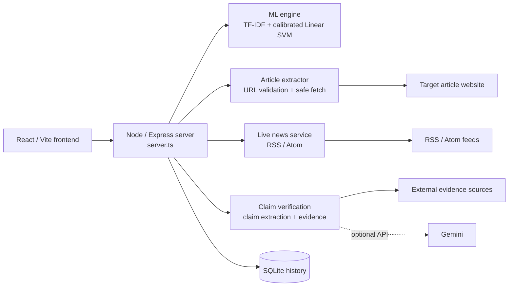
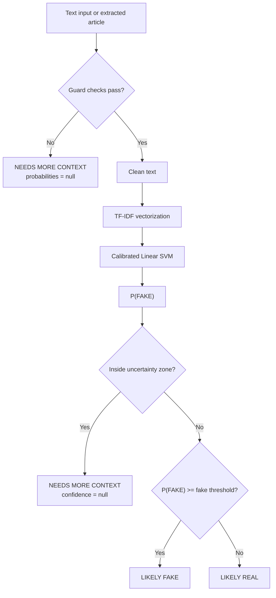

# TruthLens AI

A TypeScript/Node.js news analysis system that combines calibrated text classification, article extraction, claim verification, live RSS news, and persistent verification history.

[](https://truthlens-ai-dvpf.onrender.com)
[](package.json)
[](tsconfig.json)

[Live demo](https://truthlens-ai-dvpf.onrender.com) | [Features](#features) | [Architecture](#architecture) | [Verdict logic](#verdict-logic) | [Getting started](#getting-started) | [Deployment](#deployment) | [Testing](#testing)

## Contents

- [About](#about)
- [Features](#features)
- [Architecture](#architecture)
- [Verdict Logic](#verdict-logic)
- [Getting Started](#getting-started)
- [Environment Variables](#environment-variables)
- [Deployment](#deployment)
- [Testing](#testing)
- [Project Structure](#project-structure)
- [TDP / Academic Report](#tdp--academic-report)
- [Limitations](#limitations)

## About

TruthLens AI analyzes news text and returns one of three backend verdicts:

- `LIKELY REAL`
- `LIKELY FAKE`
- `NEEDS MORE CONTEXT`

The production inference path is implemented in TypeScript. The core model is a calibrated Linear SVM using TF-IDF features with 1-2 ngrams and sublinear term frequency. Probabilities are calibrated with Platt sigmoid scaling.

The server also supports URL article extraction, RSS news ingestion, claim extraction, evidence search, article verification, model diagnostics, dataset validation, and SQLite-backed history.

The repository also contains a Python ML/research pipeline under `backend/`. That code is retained for offline training, evaluation, and research work. It is not the production API.

## Features

| Capability | Implementation |
|---|---|
| Calibrated text classification | TF-IDF vectorization followed by a calibrated Linear SVM |
| Context guards | Minimum text length, minimum word count when no source is supplied, and an explicit headline-only guard |
| Uncertainty handling | Inputs inside the configured probability zone return `NEEDS MORE CONTEXT` instead of a forced binary verdict |
| URL article extraction | URL security validation, safe fetching, redirect checks, size/time limits, and article-body extraction |
| Live news | RSS/Atom news acquisition with caching and deduplication |
| Claim verification | Claim extraction, evidence search, and article-level verification endpoints |
| Model diagnostics | Dataset information, evaluation metrics, thresholds, calibration details, and model metadata |
| Analysis history | Verification and analysis records persisted through SQLite |
| Dataset workflows | Dataset validation, import/retraining, and demo-dataset reset endpoints |
| Single-service deployment | Vite frontend and Express API are built and served from one Node service |

## Screenshots

<!--
Add screenshots under docs/screenshots/ and uncomment the image references when
the files actually exist.

Example locations:


-->

## Architecture

TruthLens runs as a single Node/Express service in production. The browser uses same-origin `/api/*` routes. There is no separate Python API in the production request path.



The main production components are:

- `server.ts`: Express application, API routes, frontend serving, and service wiring.
- `server/mlEngine.ts`: model loading, training, vectorization, calibrated probability calculation, guards, thresholds, and verdict selection.
- `server/extraction/articleExtractor.ts`: article extraction after URL security checks and safe fetching.
- `server/news/newsService.ts`: live RSS/Atom acquisition.
- `server/verification/`: claim extraction, evidence lookup, and verification logic.
- `server/sqliteHistory.ts`: persistent analysis and verification history.

The `backend/` directory contains the offline Python/scikit-learn research pipeline. It is not called by the deployed Node service.

## Verdict Logic

The backend is the source of truth for the three verdict labels. The decision process first checks whether the input contains enough usable context. Only then does it calculate the calibrated model probability.



### Guard conditions

The current implementation applies these guards before classification:

1. Empty input is rejected as a request error.
2. Text longer than 50,000 characters is rejected.
3. Text shorter than the configured minimum length is not classified.
4. Explicit `isHeadlineOnly` input is not classified.
5. If the input has fewer than the configured minimum word count and no source URL is supplied, it is not classified.
6. When a guard fires, fake/real probabilities and confidence values are returned as `null`.

The current default thresholds in `server/mlEngine.ts` are:

| Setting | Default |
|---|---:|
| Fake threshold | 0.65 |
| Real threshold | 0.35 |
| Minimum text length | 60 characters |
| Minimum word count | 20 words |

Persisted threshold settings or model artifacts can override these defaults.

### Verdict reference

| Verdict | Meaning | What the backend guarantees |
|---|---|---|
| `LIKELY REAL` | Calculated P(FAKE) is at or below the effective real threshold. | This is a model classification, not proof that the article or claim is true. |
| `LIKELY FAKE` | Calculated P(FAKE) is at or above the effective fake threshold. | This is a model classification, not proof that the article or claim is false. |
| `NEEDS MORE CONTEXT` | A guard blocked classification, or P(FAKE) falls inside the configured uncertainty zone. | Guarded responses do not expose fake/real probabilities. Uncertain model responses return `confidence: null` and include a reason. |

For models marked as demo datasets, the effective uncertainty zone is widened. The implementation raises the fake boundary to at least 0.75 and the real boundary to at least 0.40. Extreme probabilities from such a model carry an additional caveat because a small training set does not support treating those values as verified truth.

Model artifacts are also checked for internal consistency before loading. If the vocabulary, IDF vector, weight vector, or calibration parameters are inconsistent, the artifact is rejected and the server falls back to training from the dataset.

## Getting Started

### Prerequisites

- Node.js 20 or newer.
- Python 3 only if you want to run the offline research pipeline under `backend/`.
- A Gemini API key is optional. It is used by the claim/evidence verification routes when configured.

### Install

```bash
npm install
```

### Production-style local run

```bash
npm run build
npm start
```

The local server uses port 3000 when `PORT` is not supplied.

Open:

```
http://localhost:3000
```

### Development run

```bash
npm run dev
```

The development command runs `tsx server.ts`.

## Environment Variables

| Variable | Required | Source / behavior |
|---|---|---|
| `NODE_ENV` | Required for production deployment | `render.yaml` sets this to `production`. |
| `PORT` | No | Render supplies it at runtime. The server falls back to `3000` locally. |
| `GEMINI_API_KEY` | Optional | Used by the claim/evidence verification services when configured. |

Do not commit API keys to the repository.

## Deployment

### Render

The repository includes `render.yaml` with the production service definition.

Current configuration:

| Setting | Value |
|---|---|
| Service type | Web service |
| Runtime | Node |
| Plan | Free |
| Build command | `npm install && npm run build` |
| Start command | `npm start` |
| Auto deploy | Enabled |
| `NODE_ENV` | `production` |
| `GEMINI_API_KEY` | Secret environment variable, optional |

For a new Render deployment:

1. Connect the GitHub repository to Render.
2. Use the settings from `render.yaml`.
3. Add `GEMINI_API_KEY` only if the verification features need it.
4. Deploy the service.

The application is designed to run as one Node service. The frontend and API do not require separate Render services.

## Testing

Type-check the TypeScript code:

```bash
npm run lint
```

Build the production bundle:

```bash
npm run build
```

Run the Node regression suites:

```npx tsx scripts/regressionVerdictTests.ts
npx tsx scripts/test_pipeline.ts
```

The first suite covers the verdict contract, label-swap behavior, and model-artifact integrity. The second exercises the ML pipeline.

The repository also contains an offline Python test suite:

```bash
.venv/bin/python backend/tests/test_verdicts.py
```

That command assumes a Python virtual environment named `.venv` has already been created and configured for the offline research pipeline.

## Project Structure

```
.
├── src/                         # React/Vite frontend
├── server.ts                    # Express entry point and API routes
├── server/
│   ├── mlEngine.ts              # Production ML engine and verdict logic
│   ├── extraction/              # URL/article extraction
│   ├── news/                    # RSS/Atom news service
│   ├── verification/            # Claims and evidence verification
│   ├── security/                # URL and request security
│   └── sqliteHistory.ts         # SQLite-backed history
├── backend/                     # Offline Python ML/research pipeline
├── data/                        # Datasets, thresholds, model artifacts, history
├── scripts/                     # Training, evaluation, and regression scripts
├── render.yaml                  # Render service configuration
├── package.json                 # Node scripts and dependencies
└── tsconfig.json                # TypeScript configuration
```

## TDP / Academic Report

TruthLens is a B.Tech CSE-AIML Trans-Disciplinary Project covering several engineering areas:

| Area | Project work |
|---|---|
| Machine Learning | TF-IDF features, Linear SVM, probability calibration, threshold-based decision logic |
| NLP | Text normalization, n-gram features, linguistic indicators, claim extraction |
| Data Science | Dataset validation, stratified evaluation, cross-validation, precision, recall, F1, and confusion-matrix metrics |
| Full-stack engineering | React/Vite frontend with a Node/Express backend |
| Information verification | URL extraction, claim extraction, external evidence lookup, and source metadata |
| Responsible ML | Explicit uncertainty handling, model caveats, artifact integrity checks, and a clear distinction between model output and factual proof |

For the academic report, model metrics should be taken from the repository's generated diagnostics/evaluation artifacts rather than from README marketing claims. Demo datasets are explicitly marked in the implementation and should not be presented as final-model validation.

## Limitations

TruthLens is a text-classification and verification-support system. A model probability is not proof that a real-world claim is true or false.

The production classifier evaluates linguistic patterns learned from its training data. Source provenance and verification services provide additional context, but the current ML response explicitly reports evidence verification as unavailable when the required external search/index configuration is not present.

The repository therefore treats uncertainty as a valid output rather than forcing every input into a binary real/fake result.

## License / Project Status

This repository is maintained as a university TDP project. Refer to the repository for the current implementation and deployment state.

Built by Pappu Yadav — B.Tech CSE-AIML Trans-Disciplinary Project
