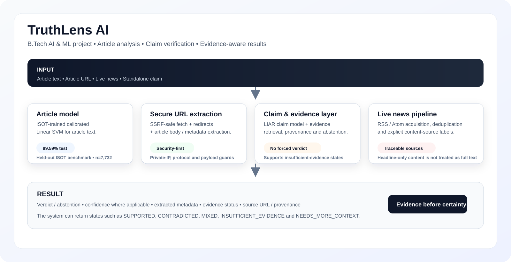
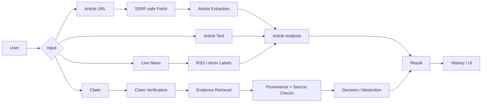
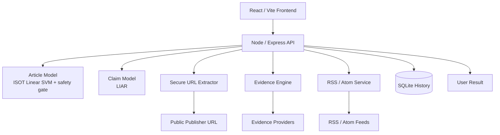

<div align="center">

# TruthLens AI

### AI-Based Fake News Detection & Article Verification System

**B.Tech Artificial Intelligence & Machine Learning — TDP Project**  
**Pappu Yadav • Vivekananda Global University, Jaipur**

<p>
  
</p>

<p>
  <a href="https://truthlens-ai-dvpf.onrender.com"></a>
  <a href="https://github.com/Pappu246/truthlens-ai-fake-news-detection-system/actions/workflows/ci.yml?query=branch%3Amain"></a>
  <a href="https://github.com/Pappu246/truthlens-ai-fake-news-detection-system"></a>
  <a href="https://github.com/Pappu246/truthlens-ai-fake-news-detection-system/blob/main/SECURITY.md"></a>
</p>

<p>
  <strong>Article → Claim → Evidence → Result</strong><br/>
  A practical verification workflow built to analyse news, retrieve supporting context, preserve source provenance, and abstain when the available evidence is not enough.
</p>

</div>

---

## Project at a glance

| | |
|---|---|
| **Student** | Pappu Yadav |
| **Program** | B.Tech — Artificial Intelligence & Machine Learning |
| **University** | Vivekananda Global University, Jaipur |
| **Project type** | B.Tech TDP / Academic Project |
| **Frontend** | React + Vite |
| **Backend** | Node.js + Express |
| **Production ML** | ISOT Linear SVM — safety-gated legacy runtime |
| **Article benchmark** | ISOT |
| **Claim benchmark** | LIAR |
| **Evidence layer** | Retrieval + provenance + abstention |
| **Deployment** | Render + Vercel |

> **Important:** TruthLens is a verification-support system. A model prediction or evidence status is not proof of a real-world claim.

---

## What TruthLens actually does

TruthLens is not just a **FAKE / REAL** classifier.

The project combines several parts into one application:

- **Article analysis** using the ISOT-trained Linear SVM. Production currently runs in a safety-gated legacy mode; calibrated probability output is withheld until the exact calibrated runtime artifact is formally promoted.
- **Claim analysis** using a separate LIAR-based model.
- **Article URL extraction** with SSRF-safe fetching and redirect validation.
- **Evidence verification** with retrieval, source provenance, and explicit abstention.
- **Live news** from RSS/Atom feeds with server-side content-source labels.
- **History** backed by SQLite.

The main design principle is simple:

> **Do not force certainty when the available information is not sufficient.**

---

## System overview



---

## End-to-end workflow


```mermaid
flowchart LR
    U[User] --> I{Input}
    I --> T[Article Text]
    I --> URL[Article URL]
    I --> C[Claim]
    I --> N[Live News]

    URL --> S[SSRF-safe Fetch]
    S --> X[Article Extraction]
    X --> A[Article Analysis]

    T --> A
    C --> V[Claim Verification]
    V --> E[Evidence Retrieval]
    E --> P[Provenance + Source Checks]
    P --> D[Decision / Abstention]

    N --> L[RSS / Atom Labels]
    L --> A

    A --> R[Result]
    D --> R
    R --> H[History / UI]
```

---

## Main features

### 1. Article analysis

The production article classifier is the ISOT-trained Linear SVM. The currently deployed artifact is running in **safety-gated legacy mode** because it does not contain the exact calibrated runtime ensemble required for faithful probability output. TruthLens therefore withholds fake/real probability percentages in production until a formally promoted exact-calibrated artifact is available.

| Metric | Held-out ISOT result |
|---|---:|
| Test samples | **7,732** |
| Accuracy | **99.59%** |
| Precision | **99.43%** |
| Recall | **99.66%** |
| F1-score | **99.54%** |

The production model is served as a separate article-analysis component and is not mixed with claim-model metrics. The benchmark figures above describe the underlying ISOT model evaluation; they do not imply that calibrated probabilities are currently exposed in production.

---

### 2. Claim verification

TruthLens keeps the claim model separate because it solves a different task on a different dataset.

| Variant | Accuracy | Macro F1 | Test n |
|---|---:|---:|---:|
| Text only | **62.72%** | **61.53%** | 802 |
| Text + available metadata | **65.84%** | **64.70%** | 802 |

The metadata-conditioned variant is used only when the required metadata is available.

**The article score and claim score are never added or averaged into one overall accuracy.**

---

### 3. Evidence-aware verification

The evidence layer follows this path:

```text
claim
  ↓
query generation
  ↓
retrieval
  ↓
relevance / support / contradiction analysis
  ↓
source + provenance checks
  ↓
final verification state
```

Possible states include:

- \`SUPPORTED\`
- \`CONTRADICTED\`
- \`MIXED\`
- \`INSUFFICIENT_EVIDENCE\`
- \`NEEDS_MORE_CONTEXT\`
- \`SEARCH_UNAVAILABLE\`

When evidence is unavailable or insufficient, the system can **abstain instead of inventing a citation**.

---

### 4. Secure article URL extraction

The URL pipeline is designed to treat external webpages as untrusted input.

It includes:

- HTTP/HTTPS-only validation;
- loopback/private/link-local/reserved IP blocking;
- DNS pre-flight checks;
- redirect validation on every hop;
- response timeout and size limits;
- content-type validation;
- publisher error handling for common 403/404/429 cases;
- removal of scripts, hidden elements, comments and common page boilerplate;
- structured-data and semantic DOM extraction.

The extraction endpoint is:

\`POST /api/article/extract\`

The complete URL-analysis path is:

\`POST /api/analyze-url\`

---

### 5. Live news

TruthLens can ingest RSS/Atom feeds and labels the content on the server before it reaches the frontend.

| Label | Meaning |
|---|---|
| \`RSS_SUMMARY_ONLY\` | Feed contains a substantive summary, not a full article body |
| \`HEADLINE_ONLY\` | Feed contains only a headline / very short description |
| \`FULL_ARTICLE_EXTRACTED\` | Full article body was actually fetched and extracted |
| \`EXTRACTION_BLOCKED\` | Publisher blocked automated article retrieval |

This prevents a headline-only item from being silently treated as a full article.

---

## Architecture


```mermaid
flowchart TB
    F[React / Vite Frontend] --> API[Node / Express API]

    API --> M1[Article Model<br/>ISOT Linear SVM + safety gate]
    API --> M2[Claim Model<br/>LIAR]
    API --> EX[Secure URL Extractor]
    API --> EV[Evidence Engine]
    API --> NEWS[RSS / Atom Service]
    API --> DB[(SQLite History)]

    EX --> WEB[Public Publisher URL]
    NEWS --> FEEDS[RSS / Atom Feeds]
    EV --> SRC[Evidence Providers]

    API --> OUT[User Result]
```

---

## Production API

| Endpoint | Purpose |
|---|---|
| \`GET /api/health\` | Service and model readiness |
| \`GET /api/models/metrics\` | Separate model / benchmark metrics |
| \`GET /api/model/diagnostics\` | Loaded model diagnostics |
| \`POST /api/analyze\` | Analyse supplied article text |
| \`POST /api/analyze-url\` | Extract and analyse article URL |
| \`POST /api/article/extract\` | Extract article body + metadata |
| \`GET /api/news/latest\` | Live RSS/Atom news |
| \`GET /api/claim/metrics\` | Claim-model metrics |
| \`POST /api/claim/predict\` | Claim prediction |
| \`POST /api/evidence/verify\` | Evidence-backed claim verification |
| \`POST /api/v2/evidence/verify\` | Experimental V2 research pipeline |

---

## Technology stack

| Layer | Technology |
|---|---|
| UI | React, Vite, Tailwind CSS |
| API | Node.js, Express, TypeScript |
| Article ML | Linear SVM + TF-IDF + Platt calibration |
| Claim ML | LIAR-based claim classifier |
| Parsing | Cheerio |
| Evidence | Retrieval + provenance + abstention |
| Storage | SQLite |
| Deployment | Render + Vercel |
| CI | GitHub Actions |

---

## Production verification

The current production line has been verified after the latest extraction compatibility fix:

- **GitHub CI:** ✅ passed on main (CI run #634; all listed jobs/steps successful)
- **Vercel production:** ✅ READY on deployment `dpl_92AnaRPHETdToqnWyTXCeY2KLiz9`
- **Production commit:** `8c8ef1d7aa4c567f7e6c97002c1fedd2f5633aa7`
- **Production runtime:** `legacy_single_svm` with probability output withheld
- **Article safety regressions:** ✅ passed (12/12 assertions)
- **Verdict regressions:** ✅ passed (24/24 assertions)
- **Runtime parity candidate:** ✅ passed (20/20 fixtures)
- **Exact calibrated candidate benchmark:** 99.7773% held-out ISOT accuracy; 99.9377% temporal accuracy; 43.1646% LIAR OOD accuracy — **research evidence only, not production-promoted**
- **Direct live HTTP smoke:** not independently executable from this environment because outbound DNS/network access is unavailable; Vercel deployment state and GitHub/Vercel checks were verified instead.

The latest extraction compatibility change updates the outgoing public-page request headers while keeping the existing SSRF and redirect protections in place.

---

## Testing

The repository includes automated checks for:

- API contracts
- verdict regression
- claim-model behaviour
- Python ↔ Node parity
- evidence verification
- model-artifact lifecycle
- SSRF protection
- V2 pipeline and routes
- research protocol validation
- live deployment smoke testing

Run the core suite locally with:

```bash
npm run lint
npm run test:all
```

For a live deployment:

```bash
npm run test:production -- <DEPLOYMENT_URL>
```

---

## Quick demo

### Article text

Paste any news article text into **Text** mode and run:

**Analyze News Text**

### Article URL

Paste a public article URL into **URL** mode:

**Extract Article → review extracted content → Analyze URL**

### Claim verification

Use a standalone factual claim and inspect:

**claim → retrieved evidence → source/provenance → verification state**

### Live news

Open **Live News**, select an item, and inspect the content-source label before analysis.

---

## Project structure

```text
.
├── src/                     # React / Vite frontend
├── server/                  # Production API and services
│   ├── extraction/          # Secure article extraction
│   ├── verification/       # Claim + evidence verification
│   ├── news/                # RSS / Atom news
│   ├── security/            # URL / SSRF controls
│   └── v2/                  # Experimental evidence pipeline
├── backend/                 # Offline ML / research pipeline
├── data/                    # Datasets and model artifacts
├── docs/                    # Architecture, reports and research notes
├── scripts/                 # Tests, evaluation and smoke scripts
├── public/                  # Static frontend assets
└── render.yaml              # Render deployment configuration
```

---

## Why I built TruthLens

I wanted this project to go beyond training a classifier and printing **FAKE** or **REAL**.

The idea behind TruthLens is to make the verification process visible:

**submit content → analyse it → inspect evidence → see the source → understand the limitation**

That is why the project includes article extraction, claim-level analysis, evidence retrieval, provenance, source labels and abstention instead of relying on a single prediction.

---

## Research track

TruthLens also contains an experimental research track that is deliberately separated from the stable production line.

Current research direction:

```text
Phase 2  → multi-benchmark evaluation
Phase 3  → retrieval-quality improvements
Phase 4  → verification reasoning
Phase 5  → reliability / adversarial robustness
Phase 6  → temporal / multilingual / out-of-domain generalization
Phase 7  → independent benchmark audit
Phase 8  → controlled promotion
```

Research results are kept separate from production accuracy claims. In particular, the exact calibrated runtime candidate has not been promoted because its LIAR out-of-domain result is 43.16%, so there is no evidence-based justification for calling the production runtime 100% accurate.

---

## Limitations

A few things are intentionally explicit:

1. The **99.59% article result** is an ISOT held-out benchmark result, not a guarantee for every current internet article.
2. The LIAR claim model is a separate, weaker signal and is not combined with the article score.
3. Evidence quality depends on the sources that are reachable at runtime.
4. Publishers can block automated retrieval; TruthLens reports that outcome instead of pretending the full article was obtained.
5. A supported evidence result is corroboration, not mathematical proof of truth.
6. Current-news, Hindi/Hinglish, satire and unseen domains can behave differently from the training/benchmark distributions.

---

## Documentation

More detailed project material is available in \`docs/\`, including:

- architecture documentation
- evidence-engine design
- claim-model protocol
- benchmark reports
- security / threat-model notes
- V2 research documentation
- Phase 2 research protocol

---

<div align="center">

### TruthLens AI

**B.Tech TDP Project by Pappu Yadav**  
**Artificial Intelligence & Machine Learning**  
**Vivekananda Global University, Jaipur**

<br/>

<a href="https://truthlens-ai-dvpf.onrender.com">Live Demo</a> •
<a href="https://github.com/Pappu246/truthlens-ai-fake-news-detection-system">GitHub Repository</a>

</div>
